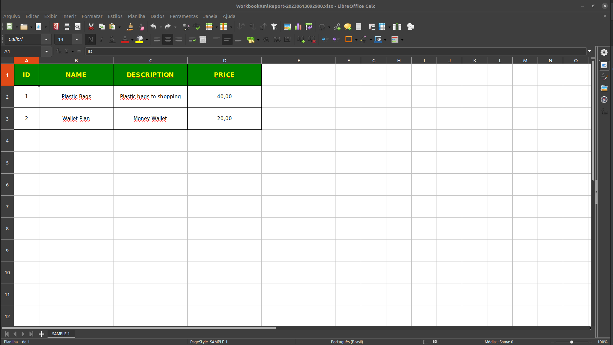

# WORKBOOK XML SPRING DEMO
A simple, small project to demonstrate how to create report sheets easily

# Language

- <a href="README.md">Portugues Brazil (pt-br)</a>
- English (en)

# Prerequisites

- spring batch
- Java 17
- H2 Database

# About

This project has the purpose to exemplify and show the use of the Apache POI XSSFWorkbook library to create
automated spreadsheets.

The project makes an abstraction of methods and settings present within the library into its scope of work, 
offering simplicity and agility in the implementation of a tool to generate spreadsheet files.

Below are some examples of spreadsheets that can be generated with WorkbookHandler by Huntercodexs:

- Example 1

- Example 2

  

# How to use

To use the Workbook Handler follow these steps:

1. Dependency

<code>

         <dependency>
             <groupId>org.apache.poi</groupId>
             <artifactId>poi-ooxml</artifactId>
             <version>4.1.0</version>
         </dependency>

</code>

2. Copy the Workbook Handler files into your project:

> /src/main/java/com/project/name/workbook

- [WorkbookHandler.java]
- [WorkbookStyles.java]
- [WorkbookColors.java]

> If there are problems with links and package paths, refactor the code, use an IDE to do this
> step (we recommend IntelliJ by JetBrains)

3. Dependency injection

<code>

     @Autowired
     WorkbookHandler workbookHandler;

</code>

4. Prepare the Header of the table that will compose the worksheet

<code>

         List<String> cols = new ArrayList<>();
         cols.add("id");
         cols.add("name");
         cols.add("description");
         cols.add("price");

</code>

- Output example:

> ['id','name','description','price']

5. Now prepare the data that will compose the body of the table
> Rows = ArrayList<List<?>>;

<code>

         ArrayList<List<?>> rows = new ArrayList<>();
         productDto.forEach(item -> {
             ArrayList<String> list = new ArrayList<>();
             list.add(String.valueOf(item.getId()));
             list.add(item.getName());
             list.add(item.getDescription());
             list.add(item.getPrice());
             rows.add(list);
         });

</code>

- Output example:

> [['1','Product 1','Product 1','100.00'],['2','Product 2','Product 2','1020.00']]

6. Prepare the worksheet for generation

> See that the table name (SAMPLE 1) is informed in the parameters, the previously generated columns and the lines that
> were also previously generated

<code>

         workbookHandler.prepare("SAMPLE 1", cols, rows);

</code>

7. Apply styles to the worksheet (optional) - HEADER

<code>

         workbookHandler.toHeader().cellBorder("full", "solid");
         workbookHandler.toHeader().backColor("pink");
         workbookHandler.toHeader().fontColor("white");
         workbookHandler.toHeader().vAlign("center");
         workbookHandler.toHeader().hAlign("middle");
         workbookHandler.toHeader().weight("bold");
         workbookHandler.toHeader().fontSize((short) 14);
         workbookHandler.toHeader().cellWidth(256);
         workbookHandler.toHeader().cellHeight(1200);

</code>

8. Create the Header

<code>

         workbookHandler.createHeader();

</code>

9. Apply styles to the worksheet (optional) - BODY

<code>

         workbookHandler.toBody().cellBorder("full", "solid");
         workbookHandler.toBody().backColor("white");
         workbookHandler.toBody().fontColor("blue");
         workbookHandler.toBody().vAlign("left");
         workbookHandler.toBody().hAlign("middle");
         workbookHandler.toBody().weight("normal");
         workbookHandler.toBody().fontSize((short) 11);
         workbookHandler.toBody().cellWidth(256);
         workbookHandler.toBody().cellHeight(500);

</code>

10. Create the Body

<code>

         workbookHandler.createBody();

</code>

11. Save the generated spreadsheet in a specific location

<code>

         workbookHandler.save("WorkbookXmlReport-"+dateTimeFormat+".xlsx");

</code>

# Sending the worksheet by email (attachment)

If you need to attach the spreadsheet for sending emails, use the following syntax:

<code>

         ByteArrayDataSource attachment = workbookHandler.bytes();

</code>

# Settings

> IDENTIFICATION

- Name for worksheet table

To define the table name use the syntax:
<pre>workbookHandler.prepare("{{TABLE-NAME-HERE}}", cols, rows);</pre>

- Name of the spreadsheet file to be generated

If you need to save the generated file, use the syntax below:
<pre>workbookHandler.save("{{FILE-PATH-HERE}}");</pre>

> FORMATTING

- edge of cells

To define a border type and where it should be applied, use the following syntax:
<pre>workbookHandler.toHeader().cellBorder("{{BORDER-PLACE-HERE}}", "{{BORDER-STYLE-HERE}}");</pre>
Where, BORDER-PLACE-HERE accepts the following values:
<pre>
     - solid
     - dashed
     - dotted
     - double
     - medium
</pre>
and for BORDER-STYLE-HERE use the following values:
<pre>
     - top
     - right
     - bottom
     - left
     - full
</pre>

- Available colors:

<pre>
     - white
     - black
     - blue
     - red
     - yellow
     - pink
     - green
     - orange
     - aqua
     - brown
     - coral
     - silver-light
     - silver
     - gray
     - dark-silver
     - gold
     - indigo
     - purple
     - lime
     - rose
</pre>

- Background color of cells
<pre>workbookHandler.toHeader().backColor("{{COLOR-HERE}}");</pre>

- Cell font color
<pre>workbookHandler.toHeader().fontColor("{{COLOR-HERE}}");</pre>

- Vertical alignment of cell contents
<pre>workbookHandler.toHeader().vAlign("{{VERTICAL-ALIGN-DIRECTION-HERE}}");</pre>
The available values for vertical alignment are
<pre>
     - left
     - right
     - center
     - justify
</pre>

- Horizontal alignment of cell contents
<pre>workbookHandler.toHeader().hAlign("{{HORIZONTAL-ALIGN-DIRECTION-HERE}}");</pre>
The available values for horizontal alignment are
<pre>
     - top
     - middle
     - bottom
</pre>

- font weight
<pre>workbookHandler.toHeader().weight("{{FONT-WEIGHT-HERE}}");</pre>
The available values for font weight are
<pre>
     - bold
     - italic
     - normal
     - underline
</pre>

- Font size
<pre>workbookHandler.toHeader().fontSize((short) {{FONT-SIZE-HERE}});</pre>
> Tip: Use the same size ratio used in spreadsheet editors like Excel

- Width of cells
<pre>workbookHandler.toHeader().cellWidth({{CELL-WIDTH-HERE}});</pre>

- Height of the line containing the cells
<pre>workbookHandler.toHeader().cellHeight({{CELL-HEIGHT-HERE}});</pre>
