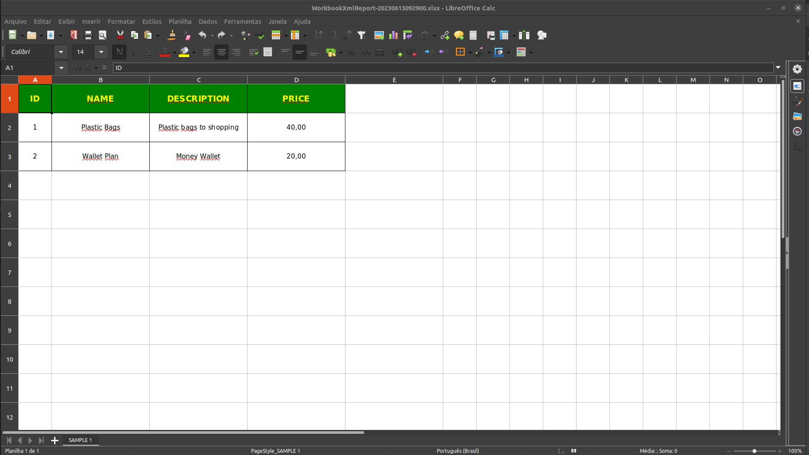
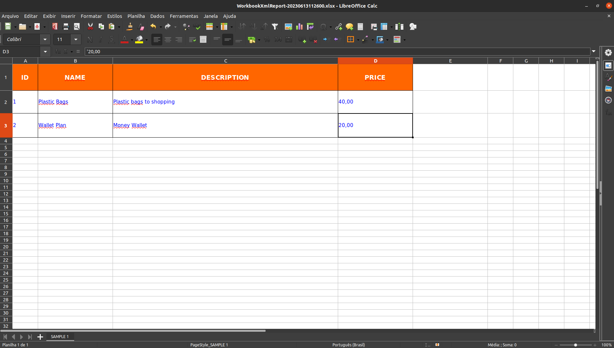

# WORKBOOK XML SPRING DEMO
Um projeto simples e pequeno para demonstrar como criar planilhas de relatorios facilmente

# Idiomas

- Portugues Brazil (pt-br)
- <a href="README-EN.md">English (en)</a>

# Pre requisitos

- Spring batch
- Java 17
- H2 Database

# Sobre

Este projeto tem a finalidade de exemplificar e mostrar o uso da biblioteca Apache POI XSSFWorkbook para criação de 
planilhas eletronicas automatizadas.

O projeto faz uma abstração de metodos e configurações presentes dentro da 
biblioteca para dentro de seu escopo de trabalho, oferecendo simplicidade e agilidade na implementação de uma ferramenta 
para gerar arquivos de planilhas eletronicas.

Abaixo alguns exemplos de planilhas que podem ser geradas com o WorkbookHandler da Huntercodexs:

- Exemplo 1

- Exemplo 2

  

# Como Usar

Para usar o Workbook Handler siga os seguintes passos:

1. Dependencia

<code>

        <dependency>
            <groupId>org.apache.poi</groupId>
            <artifactId>poi-ooxml</artifactId>
            <version>4.1.0</version>
        </dependency>

</code>

2. Copie os arquivos do Workbook Handler para dentro do seu projeto:

> /src/main/java/com/project/name/workbook

- [WorkbookHandler.java]
- [WorkbookStyles.java]
- [WorkbookColors.java]

> Caso ocorra problemas com links e paths de package faça o refatoramento do código, use uma IDE para realizar essa 
> etapa (recomendamos o IntelliJ da JetBrains)

3. Injeção de dependencia

<code>

    @Autowired
    WorkbookHandler workbookHandler;

</code>

4. Prepare a Header da tabela que vai compor a planilha

<code>

        List<String> cols = new ArrayList<>();
        cols.add("id");
        cols.add("name");
        cols.add("description");
        cols.add("price");

</code>

- Exemplo de saida:

> ['id','name','description','price']

5. Agora prepare os dados que vão compor o corpo da tabela

> Rows = ArrayList<List<?>>;

<code>

        ArrayList<List<?>> rows = new ArrayList<>();
        productDto.forEach(item -> {
            ArrayList<String> list = new ArrayList<>();
            list.add(String.valueOf(item.getId()));
            list.add(item.getName());
            list.add(item.getDescription());
            list.add(item.getPrice());
            rows.add(list);
        });

</code>

- Exemplo de saida:

> [['1','Product 1','Product 1','100.00'],['2','Product 2','Product 2','1020.00']]

6. Prepare a planilha para geração

> Veja que é informado nos parametros o nome da tabela (SAMPLE 1), as colunas geradas anteriormente e as linhas que
> também foram geradas anteriormente

<code>

        workbookHandler.prepare("SAMPLE 1", cols, rows);

</code>

7. Aplique estilos na planilha (opcional) - HEADER

<code>

        workbookHandler.toHeader().cellBorder("full", "solid");
        workbookHandler.toHeader().backColor("pink");
        workbookHandler.toHeader().fontColor("white");
        workbookHandler.toHeader().vAlign("center");
        workbookHandler.toHeader().hAlign("middle");
        workbookHandler.toHeader().weight("bold");
        workbookHandler.toHeader().fontSize((short) 14);
        workbookHandler.toHeader().cellWidth(256);
        workbookHandler.toHeader().cellHeight(1200);

</code>

8. Crie a Header

<code>

        workbookHandler.createHeader();

</code>

9. Aplique estilos na planilha (opcional) - BODY

<code>

        workbookHandler.toBody().cellBorder("full", "solid");
        workbookHandler.toBody().backColor("white");
        workbookHandler.toBody().fontColor("blue");
        workbookHandler.toBody().vAlign("left");
        workbookHandler.toBody().hAlign("middle");
        workbookHandler.toBody().weight("normal");
        workbookHandler.toBody().fontSize((short) 11);
        workbookHandler.toBody().cellWidth(256);
        workbookHandler.toBody().cellHeight(500);

</code>

10. Crie o Body

<code>

        workbookHandler.createBody();

</code>

11. Salve a planilha gerada em um local especifico

<code>

        workbookHandler.save("WorkbookXmlReport-"+dateTimeFormat+".xlsx");

</code>

# Enviando a planilha por email (anexo)

Caso seja necessário anexar a planilha para envio de emails, use a seguinte sintaxe:

<code>

        ByteArrayDataSource attachement = workbookHandler.bytes();

</code>

# Configurações

> IDENTIFICAÇÃO

- Nome para tabela da planilha

Para definir o nome da tabela use a sinstaxe:
<pre>workbookHandler.prepare("{{TABLE-NAME-HERE}}", cols, rows);</pre>

- Nome do arquivo de planilha a ser gerado

Caso seja necessário salvar o arquivo gerado use a sintaxe abaixo:
<pre>workbookHandler.save("{{FILE-PATH-HERE}}");</pre>

> FORMATAÇÃO

- Borda das celulas

Para definir um tipo de borda e onde ela deve ser aplicada, use a sequinte sintaxe:
<pre>workbookHandler.toHeader().cellBorder("{{BORDER-PLACE-HERE}}", "{{BORDER-STYLE-HERE}}");</pre>
Onde, BORDER-PLACE-HERE aceita os seguintes valores:
<pre>
    - solid
    - dashed
    - dotted
    - double
    - medium
</pre>
e para BORDER-STYLE-HERE use os seguintes valores:
<pre>
    - top
    - right
    - bottom
    - left
    - full
</pre>

- Cores disponiveis:

<pre>
    - white
    - black
    - blue
    - red
    - yellow
    - pink
    - green
    - orange
    - aqua
    - brown
    - coral
    - silver-light
    - silver
    - grey
    - dark-silver
    - gold
    - indigo
    - purple
    - lime
    - rose
</pre>

- Cor de fundo das celulas
<pre>workbookHandler.toHeader().backColor("{{COLOR-HERE}}");</pre>

- Cor da fonte das celulas
<pre>workbookHandler.toHeader().fontColor("{{COLOR-HERE}}");</pre>

- Alinhamento vertical do conteudo das celulas
<pre>workbookHandler.toHeader().vAlign("{{VERTICAL-ALIGN-DIRECTION-HERE}}");</pre>
Os valores disponiveis para alinhamento vertical são
<pre>
    - left
    - right
    - center
    - justify
</pre>

- Alihamento horizontal do conteudo das celulas
<pre>workbookHandler.toHeader().hAlign("{{HORIZONTAL-ALIGN-DIRECTION-HERE}}");</pre>
Os valores disponiveis para alinhamento horizontal são
<pre>
    - top
    - middle
    - bottom
</pre>

- Peso da fonte
<pre>workbookHandler.toHeader().weight("{{FONT-WEIGHT-HERE}}");</pre>
Os valores disponiveis para peso de fonte são
<pre>
    - bold
    - italic
    - normal
    - underline
</pre>

- Tamanho da fonte
<pre>workbookHandler.toHeader().fontSize((short) {{FONT-SIZE-HERE}});</pre>
> Dica: Use a mesma proporção de tamanho usada nos editores de planilhas eletronicas como o Excel

- Largura das celulas
<pre>workbookHandler.toHeader().cellWidth({{CELL-WIDTH-HERE}});</pre>

- Altura da linha que contem as celulas
<pre>workbookHandler.toHeader().cellHeight({{CELL-HEIGHT-HERE}});</pre>

